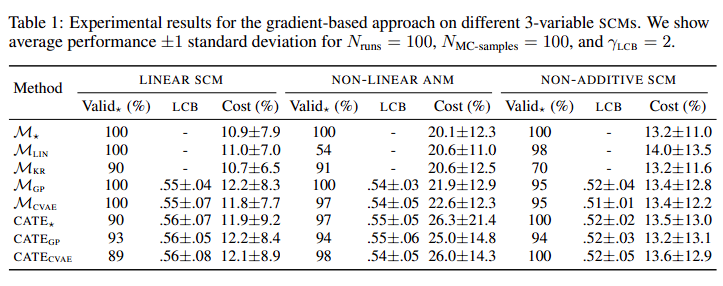

$\newcommand{\indep}{\perp \!\!\! \perp}$

# Algorithmic Recourse Under Incomplete Causal Graph

---
 
# Algorithmic Recourse: from Counterfactual Explanations to Interventions

 
## ACM 2021

---
# Algorithmic Recourse

The systematic process of reversing unfavourable decisions by algorithms and bureaucracies across a range of counterfactual scenarios.
 
---
# Problem Formulation

$$x^{\text{*CFE}} \in \underset{x}{argmin}\quad dist(x, x^F) \quad s.t. \; h(x) \neq h(x^F), x\in \mathcal{P}$$
 
---
Contd.
===
 
## Ustun et al.
$$
\begin{align}
\delta^* \in \underset{\delta}{argmin} \quad cost(\delta; x^F) \quad s.t.\; & h(x^{\text{CFE}}) \neq h(x^\text{F}),\\
& x^{\text{CFE}} = x^{\text{F}} + \delta,\\
& x^{\text{CFE}} \in \mathcal{P},\, \delta \in \mathcal{F} 
\end{align}
$$
 
---
Why does the above formulation fail?
===
- Example: Consider an example where an individual has an annual salary of \$75,000 and an account balance \$25,000. Say the model is 
$$h = sgn(X_1+5X_2 - \$225,000)$$
- The counterfactual explanation could be 
    1. Annual salary: \$100,000 or
    2. Bank Balance: $30,000
 
In a world where home-seekers save 30% of their salary, a salary increase of 14% would result in positive decision of loan-granting algorithm.
 
---
Structural Causal Model
===

---

## Proposition-1
A CFE-based action, $\mathbf{A}^{CFE}$, where $I=\{i|\delta_i^*\neq 0\}$, performed by individual $x^F$, in general results in the structural counterfactual, $x^{SCF}=x^{*CFE}:=x^{F}+\delta^*$, if and only if, the set of descendants of the acted upon variables, determined by $I$, is the empty set.

## Corollary-1
If the true world $\mathcal{M}$ is independent, i.e. all the observed features are root-nodes, then CFE-based actions always guarantee recourse.

---
Causal Persepective
===
$$
\begin{align}
\mathbf{A}^* \in \underset{A}{argmin}\quad &cost(\mathbf{A}; x^F)\\
s.t.\quad & h(x^{\text{SCF}}) \neq h(x^\text{F}),\\
& x^{\text{SCF}} = \mathbb{F_\mathbf{A}(\mathbb{F}^{-1}(x^\text{F}))}
& x^{\text{SCF}} \in \mathcal{P},\, \mathbf{A} \in \mathcal{F} 
\end{align}
$$

---

# Proposition-2
Given an individual $x^F$ observed in world $\mathcal{M}$, a family of feasible actions $\mathcal{F}$. Assume that there exists CFE-based actions $A^{CFE}\in \mathcal{F}$ that achieves recourse, i.e., $h(x^F)\neq h(x^{*CFE})$. Then, $cost(A^*;x^F) \leq cost(A^{CFE}; x^F)$

---

# Algorithm
1. **Abduction:** uniquely determines the values of all exogenous variables.
2. **Action:** modify the SCM according to the hypothetical interventions. ($\mathbb{F}_A$)
3. **Prediction:** Determine the values of of all endogenous variables.

The assignment of structural counterfactual values can generally be written as

$$
\begin{align}
x_i^{\text{SCF}} =& [i\in I]\cdot (x_i^\text{F}+\delta_i)\\
&+[i\notin I]\cdot (x_i^\text{F}+f_i(\textbf{pa}_i^\text{SCF})+f_i(\textbf{pa}_i^\text{F}))
\end{align}
$$

---
# Limitations
1. The underlying causal model is rarely known in practice.
2. The assumption of one-to-one mapping from real world actions to interventions on endogenous variables may not hold.

---
# Limitations

1. The underlying causal model is rarely known in practice.
2. The assumption of one-to-one mapping from real world actions to interventions on endogenous variables may not hold.

---
Algorithmic Recourse under imperfect causal knowledge: A probabilistic approach
===

## NeurIPS 2020
---

# Setting

The causal graph is known but the structural equations are not known.

---
# No Recourse Guarantees for unknown structural equations
**Example:** *Consider the following two SCMs $\mathcal{M_A}$ and $\mathcal{M_B}$.* 

---
# Contd.

*Choose $U_1, U_2 \sim Bernoulli(0.5)$ and $U_3 \sim Uniform(\{0,\dots,K\})$ independently in both $\mathcal{M_A}$ and $\mathcal{M_B}$ with structural equations*

*Then $\mathcal{M_A}$ and $\mathcal{M_B}$ both imply exactly the same observational and interventional distributions, and thus indistiguishable from empirical data. However, having observed $x^\text{F}=(1,0,0)$, they predict different counterfactuals had $X_1$ been 0, i.e., $x^\text{SCF}(X_1=0)=(0,0,0)$ and $(0,0,K)$, respectively.*

---

# Proposition
Unless the set of descendants of interevend-upon variables in empty, algorithmic recourse can in general, be guaranteed **only** if the true structural equations are known, irrespective of the amount and type of available data.

---

# Method

The learned causal model could be imperfect due to finite sample of the observed data, or due to model misspecification.

The authors adopt a Bayesian approach to account for the uncertainty in the estimation of the structural equations. They assume additive gaussian noise and rely on probabilistic regression using a Gaussian process (GP) prior over the functions $f_r$.

---
# GP-SCM
$$
\begin{align}
X_r:&=f_r(\mathbf{X}_{pa(r)})+U_r\\
where \quad & f_r \sim \mathcal{GP}(0, k_r),\quad U_r\sim\mathcal{N}(0, \sigma_r^2), \quad r\in [d]
\end{align}
$$

---
## GP-SCM noise posterior
$$
\begin{align}
u_r|\mathbf{X}_{pa(r)},\mathbf{x}_r &\sim \mathcal{N}\left(\sigma_r^2\left(\mathbf{K}+\sigma^2_r\mathbf{I}\right)^{-1}\mathbf{x}_r, \sigma^2_r\left(\mathbf{I}-\sigma^2_r\left(\mathbf{K}+\sigma^2_r\mathbf{I}\right)^{-1}\right)\right)\\
where \quad & \mathbf{K} := \left(k_r\left(\mathbf{x}^i_{pa(r)},\mathbf{x}^j_{pa(r)},\right)\right)_{ij} \textit{denotes the Gram matrix}
\end{align}
$$

## GP-SCM counterfactual distribution
$$
\begin{align}
X_r\left(\mathbf{X}_{pa(r) = \tilde{x}}\right)|\mathbf{x}^F,\{\mathbf{x}^i\}^n_{i=1} \sim \mathcal{N}\left(\mu^F + \mathbf{\tilde{k}}^T\left(\mathbf{K}+\sigma^2_r\mathbf{I}\right)^{-1}\mathbf{x}_r, s^F_r+\tilde{k}-\mathbf{\tilde{k}}^T\left(\mathbf{K}+\sigma^2_r\mathbf{I}\right)^{-1}\mathbf{\tilde{k}}\right)\\
where \quad \tilde{k} := k_r\left(\mathbf{\tilde{x}}_{pa(r)},\mathbf{\tilde{x}}_{pa(r)}\right), \mathbf{\tilde{k}} := \left(k_r\left(\mathbf{\tilde{x}}_{pa(r)},\mathbf{x}^1_{pa(r)}\right),...,k_r\left(\mathbf{\tilde{x}}_{pa(r)},\mathbf{x}^n_{pa(r)}\right)\right)
\end{align} 
$$

---
# Probabilistic version of the individualised recourse
$$
\min_{a=do(\mathbf{x}_{\mathcal{I}}=\theta)\in\mathbb{A}}\quad \text{cost}^F(a) \quad \text{subject to}\quad \mathbb{E}_{\mathbf{X}^{SCF}(a)}\left[h\left(\mathbf{X}^{SCF}(a)\right)\right] \geq \text{thresh(a)} 
$$

---
# Algorithm for optimization
## Brute-force approach
A way to solve the objective is
1. Iterate over $a \in \mathbb{A}^F$
2. Approximately evaluate the constraint via Monte Carlo
3. Select a minimum cost action amongst all evaluated candidates

---
# Gradient-based approach
$$
\begin{align}
\mathcal{L}(\theta, \lambda) := \text{cost}^F(a) + \lambda\left(\text{thresh}(a)-\mathbb{E}_{\mathbf{X}_{d(\mathcal{I})|\theta}}\left[h\left(\mathbf{x}^F_{nd(\mathcal{I})},\mathbf{\theta},\mathbf{X}_{d(\mathcal{I})}\right)\right]\right)
\end{align}
$$
Since GP-SCM counterfactual admit reparametrisation trick we get
$$
\begin{align}
\nabla_{\theta}\mathbb{E}_{\mathbf{X}_{d(\mathcal{I})|\theta}}\left[h\left(\mathbf{x}^F_{nd(\mathcal{I})},\mathbf{\theta},\mathbf{X}_{d(\mathcal{I})}\right)\right] = \mathbb{E}_{\mathbf{z}\sim\mathcal{N}(0,1)}\left[\nabla_{\theta}h\left(\mathbf{x}^F_{nd(\mathcal{I})},\mathbf{\theta},\mathbf{x}_{d(\mathcal{I})}(\mathbf{z})\right)\right]
\end{align}
$$

---
# Results

---
# Limitations

1. Complete causal graph should be known.
2. The assumption of one-to-one mapping from real world actions to interventions on endogenous variables may not hold.

---

<h6>Towards Incomplete Causal Graph</h6>

---

# PC Algorithm

The key idea is that two statistically independent variables are not causally linked.

1. (B) Start with fully connected graph
2. (C), (D) remove edges b/w statistically independent variables.
3. (E) Orient Colliders
4. (F) Additional Constraints.

---

# Greedy Equivalence Search (GES)

The Greedy Equivalence Search (GES) algorithm uses this trick. GES starts with an empty graph and iteratively adds directed edges to maximize the improvement in a model fitness measure (i.e. score). An example score is the Bayesian Information Criterion (BIC) 

---
# Linear Non-Gaussian Assumption

All structural equation (causal mechanisms that generate the data) are of the following form:
$$
Y := f(X) + U
$$
where $f$ is a linear function, $X \indep U$, and $U$ is distributed as some non-Gaussian

---
# Nonlinear Additive Noise Setting

$$
\begin{align}
X_i := f_i(pa_i) + U_i \quad \text{where } f_i \text{ is nonlinear}
\end{align}
$$

Theorem (Hoyer et al. 2008): Under the Markov assumption, causal sufficiency, acyclicity, the nonlinear additive noise assumption, and a technical condition from Hoyer et al. 2008, we can identify the causal graph.

---
# Post-Nonlinear Setting
Nonlinear additive noise setting: $Y:= f(x) + U, \quad X\indep U$

Post-nonlinear:
$$
Y:=g(f(X)+U),\quad X\indep U
$$

---
# References
 1. [Algorithmic Recourse: from Counterfactual Explanations to Interventions](https://dl.acm.org/doi/10.1145/3442188.3445899)

 2. [Algorithmic recourse under imperfect causal knowledge: a probabilistic approach](https://arxiv.org/abs/2006.06831)

 3. [A Linear Non-Gaussian Acyclic Model for Causal Discovery](https://dl.acm.org/doi/10.5555/1248547.1248619)

 4. [Nonlinear causal discovery with additive noise models](https://papers.nips.cc/paper_files/paper/2008/hash/f7664060cc52bc6f3d620bcedc94a4b6-Abstract.html)